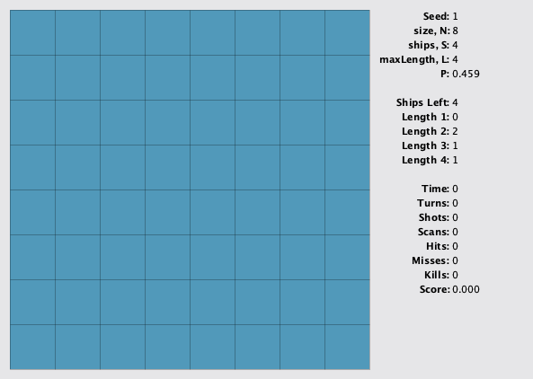

# Challenge Overview

## Marathon Match Tournament 2026

This match belongs to the Marathon Match Tournament 2026.

## Important Links

Submission-Review has been phased out. You can now find your submission artifacts under the "My Submissions" tab of the challenge.
Other Details For other details like Processing Server Specifications, Submission Queue, Example Test Cases Execution.

## Overview

You are playing a game of Battleships against the AI. The AI placed S ships onto an N*N grid and you need to find them. Each ship occupies between 1 and L (inclusive) contiguous horizontal or vertical cells. Each turn you can either shoot a specified cell or perform a radar scan of a rectangular region. Each shot has a cost of 1 and you will be told whether you missed, hit a ship or destroyed it completely. A scan costs P*log(N*N+2-A), where A is the area of the scan. The result of the scan is the number of ship cells located in the scanned region. Your task is to destroy all the ships while incurring the least cost.

Here is an animation for seed=1.



## Input and Output

This is an interactive problem, so your code must interact with the tester for each turn. Initially, your code will receive the following input values, each on a separate line:

1. N, the grid size.
2. S, the number of ships.
3. L, the maximum ship length.
4. P, the scan cost parameter.
5. L lines describing the available ships. The n-th line (1-based) is the number of ships of length n.

The following loop repeats until all ships have been destroyed:

You provide one of the following actions on a single line:
- `SHOOT r c` to shoot at row r and column c of the grid, both 0-based. The tester will return `MISS` if there was a miss, `HIT` if a ship was hit (but not destroyed), and `KILL` if a ship was destroyed.
- `SCAN r1 c1 r2 c2` to scan a rectangular region, whose corners are at (r1, c1) and (r2, c2), all 0-based. The tester will return the number of ship cells located inside the scanned region.

The tester provides the elapsed time (in milliseconds).

## Scoring

Your raw score is the cost incurred to destroy all the ships. If your return is invalid, your raw score for that test case is -1. Possible reasons include:

- Using an invalid action format.
- Shooting or scanning out of bounds.
- Shooting the same location multiple times.
- Exceeding the time limit.

If your raw score for a test case is negative, then your normalized score for that test case is 0. Otherwise, your normalized score for each test case is MIN/YOUR, where YOUR is your raw score and MIN is the smallest positive raw score currently obtained on this test case (considering only the last submission from each competitor). Finally, the sum of all your test scores is normalized to 100.

## Test Case Generation

Please look at the generate() method in the visualizer's source code for the exact details about test case generation. Each test case is generated as follows:

- N, the grid size is between 8 and 20, inclusive.
- S, the number of ships is between N/2 and floor(3*N/2), inclusive.
- L, the maximum ship length is fixed to floor(N/2).
- P, the scan cost parameter is between 0.1 and 1, inclusive.
- Start with an empty grid and place ships one at a time. First generate a ship length between 1 and L, inclusive. Find all possible locations for that ship's placement, for both horizontal and vertical directions. Ships can touch each other, but they cannot overlap. If there are no such locations available then repeat the ship length selection. Otherwise select a location uniformly at random and place the ship. Continue this process until all S ships have been placed.
- All values are chosen uniformly at random.

## Notes

- Here, log corresponds to the base-2 logarithm.
- The time limit is 10 seconds per test case (this includes only the time spent in your code). The memory limit is 1024 megabytes.
- The compilation time limit is 30 seconds.
- There are 10 example test cases and 100 provisional test cases. There will be 2000 test cases in the final testing.
- The match is rated.

## Languages Supported

C#, Java, C++, Python, and Rust.

## Submission Format

Your submission must be a single ZIP file not larger than 500 MB, with your source code only.
Please Note: Please zip only the file. Do not put it inside a folder before zipping, you should directly zip the file.

Make sure you name your Source Code file as `Battleships.<appropriate extension>`

## Sample Submissions

Here are example solutions for different languages, modified to be executed with the visualizer. You may modify and submit these example solutions:

- Java Source Code - [Battleships.java](./sample-submissions/Battleships.java)
- C++ Source Code - [Battleships.cpp](./sample-submissions/Battleships.cpp)
- Python Source Code - [Battleships.py](./sample-submissions/Battleships.py)
- C# Source Code - [Battleships.cs](./sample-submissions/Battleships.cs)
- Rust Source Code - [Battleships.rs](./sample-submissions/Battleships.rs)

## Tools

An offline tester is available below. You can use it to test/debug your solution locally. You can also check its source code for an exact implementation of test case generation and score calculation. You can also find links to useful information and sample solutions in several languages.

### Downloads

- Visualizer Source - [BattleshipsTester](./visualizer/)
- Visualizer Binary - [tester.jar](./visualizer/tester.jar)

### Offline Tester / Visualizer

Your solution should interact with the tester/visualizer by reading data from standard input and writing data to standard output.

To run the tester with your solution, you should run:

```
java -jar tester.jar -exec "<command>" -seed <seed>
```

Here, `<command>` is the command to execute your program, and `<seed>` is seed for test case generation.
If your compiled solution is an executable file, the command will be the full path to it, for example, `"C:\TopCoder\Battleships.exe"` or `"~/topcoder/Battleships"`.
In case your compiled solution is to be run with the help of an interpreter, for example, if your program is in Java, the command will be something like `"java -cp C:\TopCoder Battleships "`.

Additionally, you can use the following options:

- `-seed <seed>`. Sets the seed used for test case generation. Seed 0 generates random grids. Seed 1 uses the lowest values of the parameters. Seed 2 uses the highest values of the parameters. The default seed value is 1.
- `-debug`. Print debug information.
- `-noanimate` Do not display the animations and only show the final state.
- `-novis`. Turns off visualisation.
- `-noimages`. Turns off images.
- `-manual`. Play the game manually. Use the left click to shoot and two right clicks to select the scan region.
- `-pause`. Starts the visualizer in paused mode. See more information below.
- `-delay <delay>`. Sets the delay (in milliseconds) between visualizing consecutive simulation steps, default is 100.
- `-N <N>`. Sets a custom grid size.
- `-S <S>`. Sets a custom number of ships.
- `-P <P>`. Sets a custom scan cost parameter.

The visualizer works in two modes. In regular mode, steps are visualized one after another with a delay specified with the -delay parameter. In paused mode, the next move will be visualized only when you press any key. The space key can be used to switch between regular and paused modes. The default starting mode is regular. You can use the -pause parameter to start in paused mode.

Marathon local testers have many useful options, including running a range of seeds with a single command, running more than one seed at time (multiple threads), controlling time limit, saving input/output/error and loading solution from a file. The usage of these options are described [here](./mm-local-tester-parameters.md).
